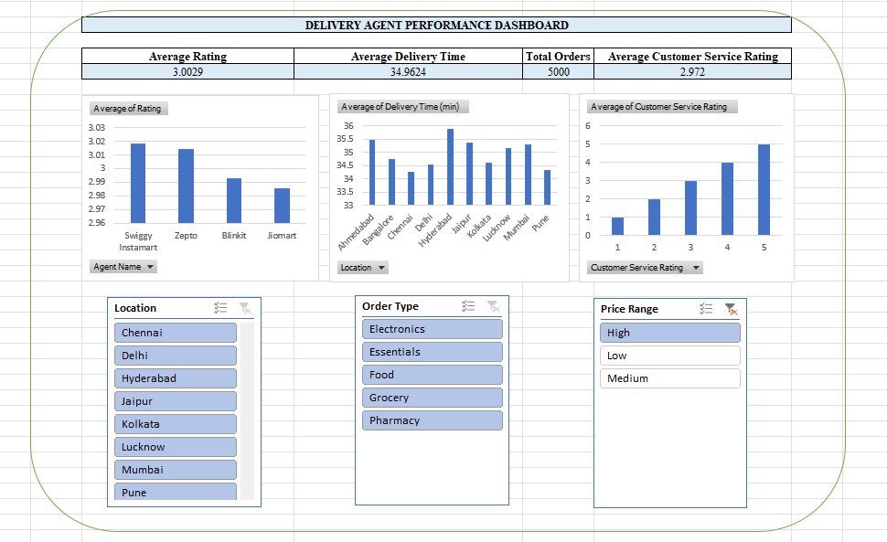
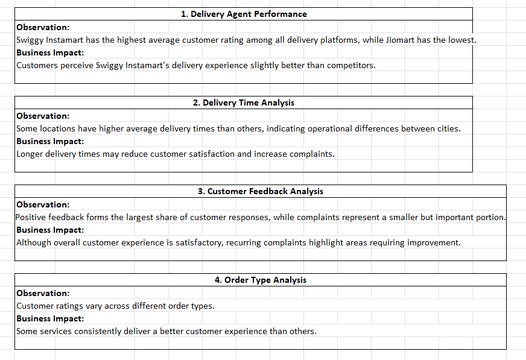
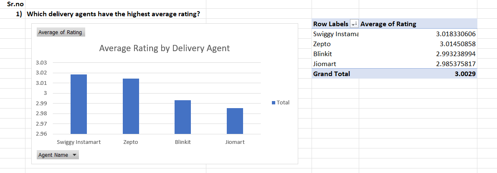
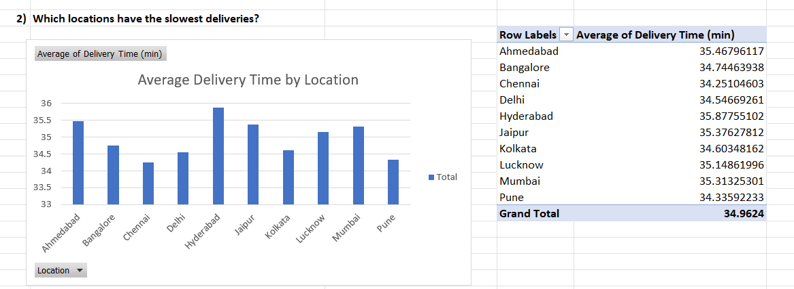
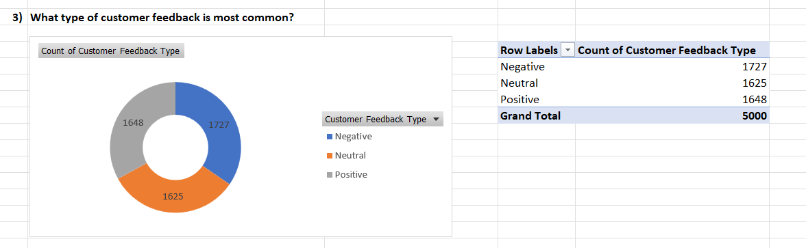
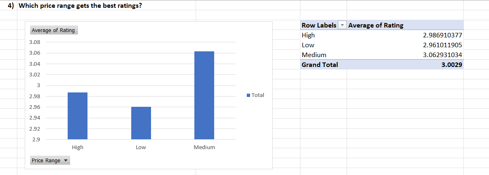
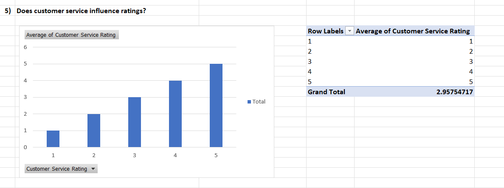

# Delivery Data Analysis using Microsoft Excel

## Project Overview
This project focuses on analyzing a delivery dataset using Microsoft Excel. The analysis involves data cleaning, exploratory data analysis (EDA), dashboard creation, data visualization, and extracting business insights to understand delivery performance and trends.

## Tools & Techniques Used
- Microsoft Excel
- Pivot Tables
- Pivot Charts
- Excel Functions
- Data Cleaning
- Data Visualization

## Project Workflow
1. Imported the delivery dataset
2. Cleaned and prepared the raw data
3. Performed Exploratory Data Analysis (EDA)
4. Created Pivot Tables and visualizations
5. Built an Excel dashboard
6. Generated actionable business insights

## Project Files
- Delivery Dataset.xlsx
- Raw Data
- Cleaned Data
- Pivot Tables
- Visualizations
- Excel Dashboard
- Business Insights

## Dashboard Preview

### Exploratory Data Analysis (EDA)

### Business Insights

### Visualizations

#### Visualization 1

#### Visualization 2

#### Visualization 3

#### Visualization 4

#### Visualization 5

## Key Insights
- Analyzed overall delivery performance.
- Identified important trends and patterns in delivery data.
- Created visual reports to support business decision-making.
- Highlighted areas for improving delivery efficiency.

## Skills Demonstrated
- Data Cleaning
- Data Analysis
- Microsoft Excel
- Excel Dashboard Development
- Pivot Tables & Pivot Charts
- Data Visualization
- Business Intelligence & Insights
